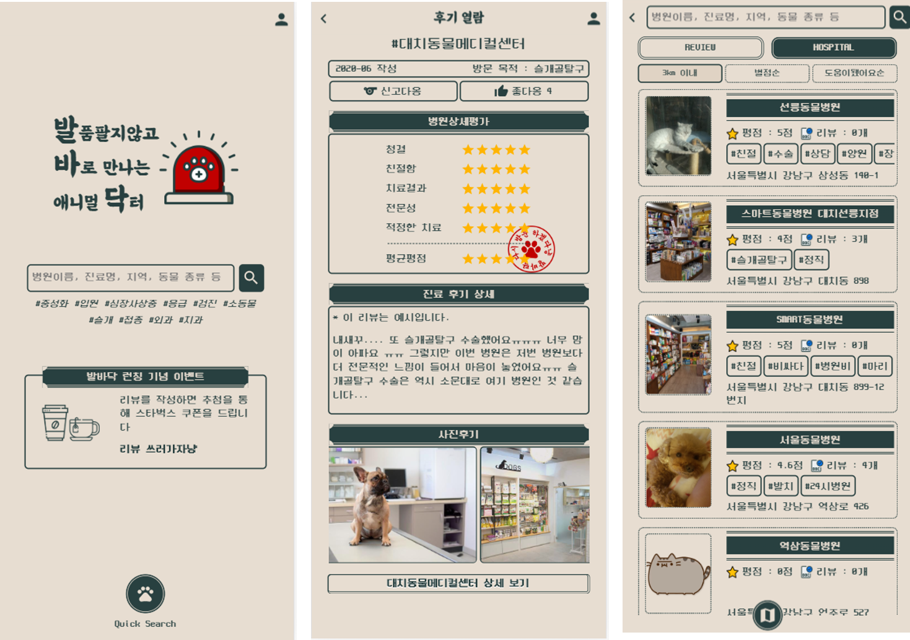
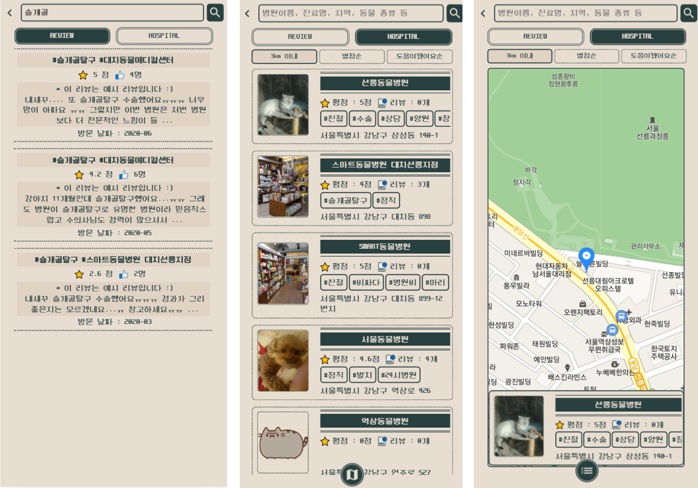
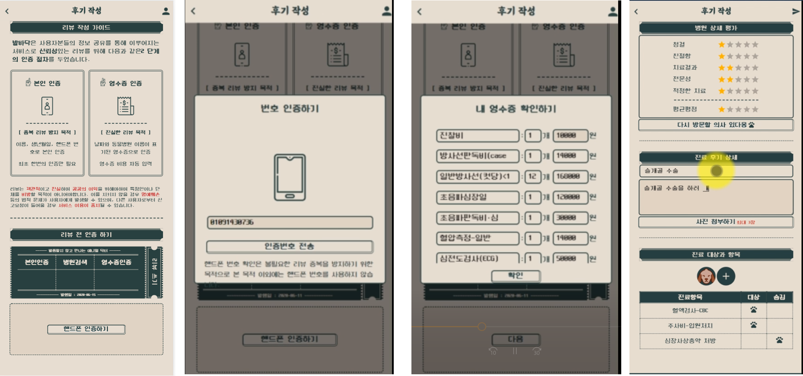
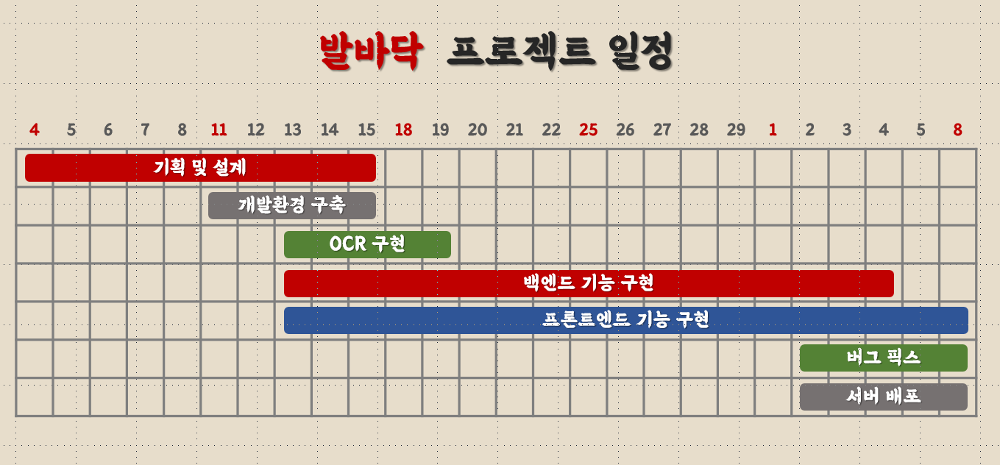

# README

- 프로젝트 요약

  |              | 내용                                                         |
  | ------------ | ------------------------------------------------------------ |
  | 기한 및 인원 | 약 26일/ 5명                                                 |
  | 주제         | 발품팔지 않고 바로 만나는 애니멀 닥터 : 동물병원 정보 공유 플랫폼 |
  | 주요 기능    | 동물병원 및 리뷰 정보 제공, 영수증 자동 인식을 통한 편리하고 신뢰성있는 리뷰 작성 |
  | 기술 스택    | Spring, MySQL, React, Kakao map api, google cloud vision, AWS EC2, S3 |
  | 맡은 역할    | 팀장, 기획(공통), 데이터 수집 및 가공, 영수증 인증 기능, 프론트엔드, 디자인 |
  | 결과물       | [발바닥 배포](www.balbadack.com) (공통) / [영수증 항목 추출 모듈](https://www.npmjs.com/package/@ming822/ocr-reciept-helper) (개인) |

  

- 발바닥은 www.balbadack.com 에서 만나보실 수 있습니다 :paw_prints:

## 0. 발바닥은?

- **발**품팔지 않고 **바**로 만나는 애니멀 **닥**터 : 동물병원 정보 공유 플랫폼
- 1000만 명이 넘는 반려인에도 불구하고 동물병원에 대한 정보를 찾기는 쉽지 않고 진료비 표준이 존재하지않아 항목에 따라 크게는 80배 가까이 진료비가 차이가 나기도 합니다.
- 발바닥에서는
  - 서울 지역의 동물병원의 정보와 함께
  - **신뢰성 있는 동물병원 후기와 가격정보**를 공유할 수 있습니다.
    - 핸드폰 인증을 통해 중복 리뷰를 방지하고
    - **영수증 인증**을 통해 해당하는 동물 병원일 경우에만 가격 정보를 업로드 할 수 있습니다. 
- 발바닥을 통해 
  - **반려인**들은 편리하고 쉽게 동물병원 정보를 얻을 수 있고 자신의 진료 경험을 공유할 수 있음 
  - **수의사**들은 기존의 정보의 비대칭 해소에 기여하고 본인의 동물병원을 홍보할 수 있음

## 1. 발바닥 가이드

### 1. 늦은 시간 햄스터가 구토를 하고 있어요 ㅜㅠ

- 저희 서비스의 메인 화면 Quick Search 버튼을 통해  내 주위 3Km 이내의 병원에서 별점 이 높은 순,  리뷰가 많은 순으로 정렬해서 확인할 수 있습니다.
- 직접 '햄스터'나 '24시' 등의 키워드를 통해 저희가 리뷰를 텍스트 분석해서 달아둔 병원 태그를 이용해서원하는 정보만 검색할 수도 있습니다. 
- 아래 지도 버튼을 클릭할 경우 지도에서 해당 병원의 위치도 확인할 수 있습니다.

### 2.혹시 리뷰를 작성했는데 애완동물한테 불이익이 갈까요ㅠ?

- 사용자들이 솔직하고 객관적인 리뷰를 마음껏 작성하실 수 있도록 철저한 익명보장을 위해 노력했습니다.
- 리뷰에 닉네임이나 아이디가 전혀 노출되지 않고 상세 별점 이외의 방문 목적, 방문날짜, 작성자 모두 비공개처리되고 저희 데이터를 위해서만 이용됩니다.
-  영수증 리뷰기능은 사용자들의 편의와 진료항목 확인용으로만 이용되기 때문에 병 원관계자들 페이지에 노출될 걱정 없이 편하게 이용하실 수 있습니다. 
- 전체 진료항목과 가격은 병원 상세페이지에서 한 번에 보여주기 때문에 리뷰를 통해 작성자를 유추할 수도 없습니다

### 3. 과잉진료를 하지 않는 합리적인 병원을 찾고싶어요!

- 마찬가지로 검색서비스에 '정직'이라는 키워드로 병원을 검색한다면 검색 결과 내의 다른 병 원과 평점을 비교할 수 있습니다.

- 병원을 클릭하여 상세페이지에서 항목별로 가격을 체크할 수도 있습니다. 동물의 경우 같은 항목에 대해 진료를 받더라도 동물의 종류나 나이, 상태에 따라서 금액의 차이가 생기는 경우가 많기 때문에 동일 항목에 대해서도 각 동물 종류별로 사용자들이 직접 입력한 금 액을 범위로 표현하였습니다.

  

### 4.  저희 서비스가 수의사에겐 어떤 장점과 기대효과를 가져올까요? 

1. **정직한 병원들이 손해보지 않는 플랫폼입니다.** 
   영수증인증을 완료한 객관적인 리뷰들의 평점순, 개수가 많은 순으로 정렬이 가능하기 때문에 자연스럽게 정직한 병원들이 상위에 노출됩 니다. 
2. **또한 사용자들이 악의적인 리뷰를 작성할 경우를 대비하여**
   리뷰를 처음 작성하기 전 반드시 핸드폰으로 본인 인증을 마쳐야 하고,
   OCR기반 영수증 인증을 도 입하여 리뷰의 신뢰도를 보장하였습니다. 
   악의적인 비방글이 있을 경우 사용자들의 신고기능을 통 해 조치를 취할 수 있습니다.

## 2. 기술 스택

- **backend**
  - spring
  - MySQL
- **frontend**
  - react 웹 프레임워크
  - 카카오 맵 api
    - 병원 상세페이지
    - 병원 검색페이지
  - [구글 클라우드 vision api](https://cloud.google.com/vision/docs/ocr#vision_text_detection_gcs-nodejs)
    - 영수증 인증시 ocr (optical character recognition) 활용
    - [이후 알고리즘으로 ocr 결과에서 영수증 항목 추출](https://www.npmjs.com/package/@ming822/ocr-reciept-helper)
  - AWS S3
- **deploy**
  - AWS EC2
  - nginx

## 3. 개발 일정

- 총 개발 기간 약 26일 (5/4 - 6/8)
- **1주차** : 기획 및 설계
- **2주차**: 개발환경 구축 및 데이터 수집
- **3주차**
  - 데이터 가공 및 영수증 인증 기능 구현 (ocr api + 영수증 항목 추출 알고리즘)
  - 백엔드 & 프론트 엔드 개발
- **4주차 & 5주차**
  - 백엔드 & 프론트 엔드 개발
- **6주차** : 서버 배포, 버그 픽스, 발표 준비

